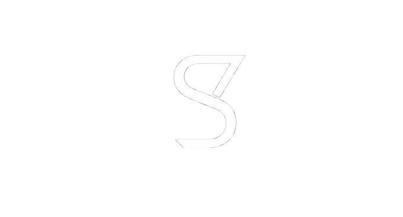

<h1 align="center">Signologos</h1>

<p align="center">
  
</p>


La palabra hecha signo, **Signologos** es un traductor web **potenciado con IA** que tiene como objetivo mejorar la comunicación entre personas a traves de un **lenguaje universal** como lo es el lenguaje de signos.

<p align="center">
  
  
  
</p>

---


  *Construido con*
  <p align="center">


</p>

## Concepto

**Simbologos** es un proyecto de código abierto diseñado para simplificar la creación y gestión de símbolos personalizados para diversos proyectos, desde el desarrollo de mapas y aplicaciones hasta la documentación técnica. El objetivo principal es ofrecer una solución robusta y flexible que permita a los desarrolladores y diseñadores integrar una simbología coherente y funcional en sus trabajos.


    
  **Soporte a la comunicación aumentativa y alternativa (CAA)** - Ayudar a personas a expresar sus ideas a través de una representación visual.

  **Gestión de metadatos** - Cada símbolo puede ser etiquetado y categorizado con metadatos específicos (por ejemplo, tipo, función, color), lo que permite una búsqueda y filtrado eficientes dentro de la biblioteca.

   **Interfaz de línea de comandos (CLI)** - Para desarrolladores, se incluye una CLI que permite automatizar tareas como la generación de conjuntos de símbolos o la conversión de formatos.

## Instalación

Clonar el repositorio
```bash
  git clone https://github.com/meatbaalzzz/signologos
  cd signologos
```

Instalar dependencias
```bash
  npm install react@^18.2.0 react-dom@^18.2.0 react-router-dom@^6.15.0 zustand@^4.4.0 @tanstack/react-query@^4.32.0 @mediapipe/tasks-vision@^0.10.0 @tensorflow/tfjs@^4.10.0 @tensorflow/tfjs-vis@^1.5.1 framer-motion@^10.16.0 gsap@^3.12.0 lottie-web@^5.12.2
```

## Uso de Simbologos

Una vez instalado, puede usar el proyecto con 
```bash
  npm start
```

Para testeo, ejecute
```bash
  npm test
```
